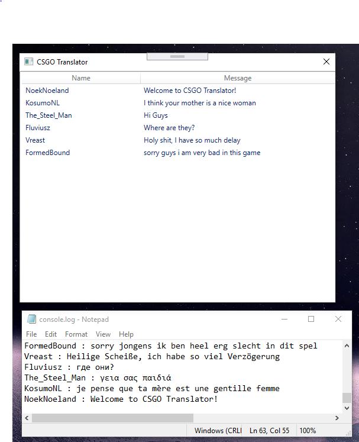

# CSGO-Translator
Simple C# CSGO chat translator

Ever wondered what your foreign language speaking teammates where trying to tell you?
Well wonder no more, because CSGO-Translator is here.

CSGO-Translator is a C# .NET WPF based tool that will automatically detect new chat messages, and translate them to English using Google Translate.

It works by reading the console logfile and analysing it for new messages every few seconds.

WILL ONLY WORK WHEN CSGO IS INSTALLED UNDER THIS PATH (for now)

C:\Program Files (x86)\Steam\steamapps\common\Counter-Strike Global Offensive

100% safe to use on official servers!

SETUP:
1. Download the lastest release (or build it yourself)
2. run CSGO-Translator.exe
3. Move the window to your second monitor (or just alt + tab)
3. Start up a game of CSGO
4. Enter the console command: con_logfile "console.log" (or add it to your autoexec.cfg)
5. See live translations of your incoming chat messages

CURRENT LIMITATIONS:
1. Can only translate messages to English (for now)
2. Will only work when CSGO is installed under the default path. (for now)
3. Might get a timeout from Google Translate under extreme use.
4. Won't display new message when an identical message has been sent recently (to avoid the Google Translate timeout).
5. Won't display chat messages on certain community servers because of different chat structures.
