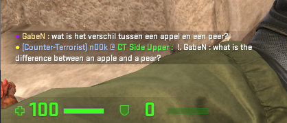
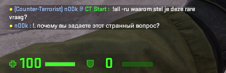
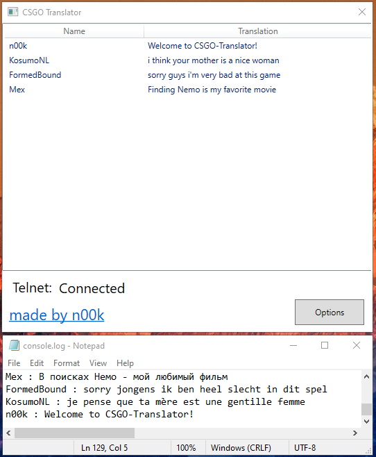
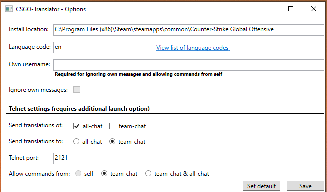

# CSGO-Translator
Easy to use, single-file CS:GO chat translation tool. 

You probably know the feeling of not being able to communicate in a match because everyone speaks a different language.
Well, gone are those days. With this tool you can read translations of all foreign language messages, and even respond to them in their language. All while staying in the game.

CSGO-Translator will read the console output, detect chat messages, and then translate them with Google Translate. These translations can then be sent back to the in-game chat using Telnet.

You can also send a command to CSGO-Translator from the in-game chat. Which allows you to request a translation for some text in any language. This translation will then be sent in the in-game chat using Telnet.

All of this is accomplished using official CS:GO launch options. So this should be safe to use on official servers.

## How to use

1. Download the [latest release](https://github.com/NiekNijland/CSGO-Translator/releases) (or build it yourself)
2. Set CS:GO launch options: `-condebug` & `-netconport 2121` ([how do I do this?](https://support.steampowered.com/kb_article.php?ref=1040-JWMT-2947)) 
3. start CS:GO & CSGO-Translator
4. (Optional) Change the options in CSGO-Translator to your liking. ([List of language codes](https://cloud.google.com/translate/docs/languages))
5. Read translations & send commands in the in-game chat!

## Features & Examples

### Translations in in-game chat
<br /><br />
By default all messages from the all-chat which are not in your preferred language (set in the options), will be sent to your team-chat.
You can change this in the options menu.

### Commands from in-game chat
<br /><br />
By default commands are allowed from the team-chat. You can change this in the options menu.<br /><br />
Command structure:<br />
```
!team/all (-languagecode) MESSAGE
```

Example commands:<br />
```
!team what are you doing?
```
```
!team -fr вау, ты действительно хорош 
```
```
!all -ru wat is jouw favoriete fruit?
```
```
!all -zh-TW I am peeking middle
```
If no `-languagecode` is given, it will default to the language code that is set in the options menu.<br />
[You can find the full list of supported language codes here](https://cloud.google.com/translate/docs/languages)

### Translations
<br /><br />


### Options
<br /><br />
By selecting __Ignore own messages__ your chat messages (not commands) will be ignored by the translator. 

### Other features
* Very simple to use
* Lots of languages supported ([Full list of language codes](https://cloud.google.com/translate/docs/languages))
* Translations are cached, so the same translation is used for identical messages.
* Will work with all CS:GO install locations.
* Everything can be done from the game, no need to Alt + Tab.

### Current limitations
* The current method of using Google Translate is rate-limited at 100 requests / hour.
* Can't detect messages on certain community servers because of different chat structures.
